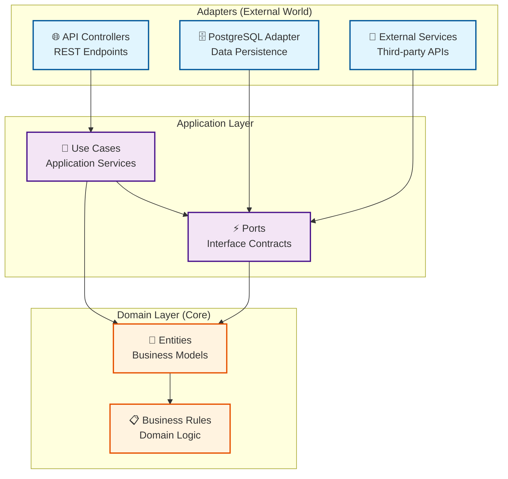

# .NET Ports & Adapters API Template Overview

## 🎯 What is This Template?

This is a **foundational .NET 9.0 API template** built using the **Hexagonal Architecture (Ports & Adapters)** pattern. It provides the architectural skeleton and infrastructure setup for building scalable, maintainable, and secure REST APIs with modern best practices baked in from the start.

Think of it as a "starter kit" that handles authentication, observability, security, and infrastructure concerns - giving you a clean architectural foundation to build your business logic upon. **Note**: This template focuses on the architectural foundation rather than business feature implementations.

---

## 🏗️ Architecture Overview

### Hexagonal Architecture (Ports & Adapters)

This template implements the Hexagonal Architecture pattern, which separates your application into distinct layers:



**Why This Matters:**
- **Testability**: Easy to unit test business logic without external dependencies
- **Flexibility**: Swap out databases, APIs, or other external systems without changing core logic
- **Maintainability**: Clear separation of concerns makes code easier to understand and modify

---

## 📁 Project Structure Breakdown

```text
src/
├── iaasdatabasepatching.sln                    # Solution file
├── Dockerfile                             # Container configuration
│
├── Api/                                   # 🌐 External Interface Layer
│   └── gto.myapp.api/
│       ├── Controllers/                   # REST API endpoints
│       ├── Handlers/                      # Middleware & DI setup
│       └── Program.cs                     # Application entry point
│
├── Application/                           # 🔧 Use Cases & Application Services
│   └── gto.application/
│       ├── Data/                          # Port interfaces (contracts)
│       └── Mappers/                       # Data transformation logic
│
├── Domain/                                # 💼 Business Logic Core
│   └── gto.domain/
│       ├── Auth/                          # Authentication models
│       ├── Entities/                      # Domain models
│       ├── Generic/                       # Shared base classes
│       ├── Logging/                       # Logging interfaces
│       └── SwaggerExamples/               # API documentation examples
│
├── Adapters/                              # 🔌 External System Integrations
│   ├── gto.datapersistance.postgresql/
│   │   ├── Adapter/                       # PostgreSQL implementation
│   │   ├── DTOs/                          # Database transfer objects
│   │   ├── Mappers/                       # Entity-DTO mapping
│   │   └── Repository/                    # Data access patterns
│   └── gto.secretstorage.dapr/
│       └── DaprSecretProvider.cs          # Dapr secrets management adapter
│
└── Test/                                  # 🧪 Testing Projects
    ├── Api.Test/                          # API integration tests
    ├── Application.Test/                  # Business logic tests
    ├── Domain.Test/                       # Domain model tests
    └── Adapter.postgresql.Test/           # Database adapter tests
```

---

## 🚀 Key Features Explained

### 1. **API Versioning**
```csharp
[ApiVersion("1.0")]
[ApiVersion("2.0")]
[Route("api/v{version:apiVersion}/[controller]")]
```
- Supports multiple API versions simultaneously
- Clients can specify version via URL (`/api/v1/auth`) or headers (`X-Api-Version`)
- Enables smooth transitions when updating APIs
- Currently implemented on the `AuthController`

### 2. **JWT + API Key Authentication**
- **JWT Tokens**: Stateless authentication with RSA256 signing using PEM certificate
- **API Keys**: Simple authentication via `X-Api-Key` header (implemented in `ApiKeyAuthenticationHandler`)
- **Dual Authentication**: Supports both JWT Bearer tokens and API key authentication
- **Swagger Integration**: Test authentication directly in API docs with built-in "Authorize" button
- **RSA Key Management**: Uses RSA private key from PEM certificate for JWT signing

### 3. **Observability & Monitoring**
```csharp
// OpenTelemetry integration for distributed tracing
builder.Services.AddOpenTelemetry()
    .WithTracing(builder => builder.AddAspNetCoreInstrumentation())
    .WithMetrics(builder => builder.AddAspNetCoreInstrumentation());
```
- **Distributed Tracing**: Track requests across services
- **Metrics Collection**: Monitor performance and usage
- **Structured Logging**: JSON-formatted logs with correlation IDs
- **Multiple Exporters**: Console, Jaeger, Zipkin, Prometheus, Azure Monitor

### 4. **Security Best Practices**
- **Rate Limiting**: Global rate limiter with 100 requests/minute fixed window policy
- **CORS Policy**: Configurable cross-origin resource sharing (configured in Program.cs)
- **Input Sanitization**: Log injection prevention in controllers (see `SanitizeForLogging` method)
- **Authentication Handlers**: Custom API key and JWT Bearer authentication handlers
- **Exception Handling**: Global error handling middleware (`ExceptionHandlingMiddleware`)
- **Secure Configuration**: Secrets managed through Dapr secret stores

### 5. **Database Integration (PostgreSQL Adapter)**
```csharp
// Repository pattern interface
public interface IDataPersistance
{
    Task<TransactionSystemModel?> UpsertTransactionAsync(TransactionSystemModel entity);
}
```
- **Repository Pattern**: Interface-driven data access with `PostgreSqlAdapter` implementation
- **PostgreSQL Adapter**: Complete adapter with connection string management
- **Generic Repository**: `IPostgreSqlRepo<T>` pattern for reusable data access  
- **DTO Mapping**: Bidirectional mapping between `TransactionSystemModel` and `TransactionDto`
- **Transaction Support**: Built-in transaction scope activity tracing

### 6. **Dapr Integration (Microservices Ready)**
```csharp
// Dapr secrets management
public class DaprSecretProvider : ISecretProvider
{
    public async Task LoadSecretsAsync(IEnumerable<string> secretNames)
}
```
- **Service Invocation**: Built for microservices communication
- **Secret Management**: Dapr-based secure configuration loading
- **State Management**: Pluggable state stores for distributed scenarios
- **Pub/Sub Ready**: Event-driven architecture support
- **Environment Variables**: `DAPR_HTTP_PORT`, `DAPR_SECRET_STORE` configuration

#### 🔐 Secrets Configuration Instructions
**Important**: All application secrets must be configured in the Dapr secrets file:
- **Location**: `src/Adapters/gto.adapterdapr.components/secrets.json`
- **Required Secrets**: `AccessKey`, `AccessSecret`, `XApiKey`
- **⚠️ Security Warning**: This file contains placeholder values for development only
- **DO NOT** commit real secrets to GitHub - secrets are injected via Dapr in production
- **Production**: Real secrets come from secure Dapr secret stores (Azure Key Vault, AWS Secrets Manager, etc.)
- **Local Development**: Update the placeholder values in `secrets.json` with your development credentials

---

## 🔄 How the Layers Work Together

### Current Implementation: Authentication Flow

**Important**: This template currently provides the **architectural foundation** with a working authentication system. Business logic controllers and use cases are not yet implemented - you'll build these on top of the provided structure.

1. **API Layer** (`AuthController.cs`):
   ```csharp
   [HttpPost("token")]
   public async Task<IActionResult> GenerateToken([FromBody] JwtTokenRequest request)
   ```
   - Handles JWT token generation
   - Validates credentials against Dapr secrets
   - Returns signed JWT tokens
   - Includes input sanitization and activity tracing

2. **Application Layer** (Interface Definitions):
   ```csharp
   // Port interface ready for your implementation
   Task<TransactionSystemModel?> UpsertTransactionAsync(TransactionSystemModel entity);
   ```
   - Defines contracts for business operations
   - `ISecretProvider` interface for configuration management
   - Ready for your use case implementations

3. **Domain Layer** (Domain Models):
   ```csharp
   public class TransactionSystemModel : BaseEntity
   {
       public Guid? TransactionId { get; set; }
       public string? Description { get; set; }
   }
   ```
   - Contains domain entities and authentication models
   - Pure business models with no external dependencies
   - Includes `JwtTokenRequest/Response` for authentication

4. **Adapter Layer** (External Integrations):
   ```csharp
   public class PostgreSqlAdapter : IDataPersistance
   public class DaprSecretProvider : ISecretProvider
   ```
   - PostgreSQL adapter implements data persistence interface
   - Dapr adapter handles secure secret management
   - Ready to plug into your business use cases

---

## What's Implemented vs. What You Need to Build

### ✅ **Already Implemented (Infrastructure & Foundation)**
- **Authentication System**: Complete JWT + API Key authentication with RSA signing
- **API Versioning**: URL and header-based versioning support
- **OpenTelemetry Observability**: Tracing, metrics, and multiple exporters (Console, Jaeger, Zipkin, Azure Monitor)
- **Rate Limiting**: Global rate limiter (100 req/min) with 429 responses
- **Security Middleware**: Exception handling, input sanitization, CORS
- **Dependency Injection**: Complete DI setup with service registration
- **Dapr Integration**: Secrets management with fallback to local development
- **PostgreSQL Adapter**: Complete database adapter with DTO mapping
- **Docker Support**: Multi-stage Dockerfile and docker-compose configuration
- **Testing Framework**: XUnit, Moq, and test project structure
- **Health Checks**: Built-in health check endpoints

### 🏗️ **What You Need to Build (Business Logic)**
- **Business Controllers**: API endpoints for your domain operations (only `AuthController` exists currently)
- **Use Case Implementations**: Application services that orchestrate business operations
- **Domain Business Rules**: Complex business logic beyond the basic entity models
- **Additional Domain Entities**: Your specific business models beyond `TransactionSystemModel`
- **Integration Tests**: Comprehensive API and integration test implementations
- **Additional Adapters**: External service integrations beyond PostgreSQL and Dapr

### 🎯 **Where to Start Building**
1. **Add Business Controllers** in `src/Api/gto.myapp.api/Controllers/`
2. **Implement Use Cases** in `src/Application/gto.application/`
3. **Extend Domain Models** in `src/Domain/gto.domain/Entities/`
4. **Create Additional Adapters** in `src/Adapters/` as needed

---

## Getting Started

### Prerequisites
- .NET 9.0 SDK
- Docker (optional, for containerization)
- PostgreSQL (for database adapter)

### Quick Start
1. **Clone and Setup**:
   ```bash
   git clone <your-repo>
   cd pg-gto-portsadapters-template
   ```

2. **Configure Settings**:
   - Update `appsettings.json` with OpenTelemetry exporters and other non-sensitive configuration
   - **Configure secrets in Dapr**: Update `src/Adapters/gto.adapterdapr.components/secrets.json` with your development credentials:
     - `AccessKey`: Your access key for JWT authentication
     - `AccessSecret`: Your access secret for JWT authentication  
     - `XApiKey`: Your API key for X-Api-Key header authentication

3. **Run the Application**:
   ```bash
   dotnet run --project src/Api/gto.myapp.api/gto.iaasdatabasepatching.myapp.api.csproj
   ```
   Or using Docker:
   ```bash
   docker-compose up --build
   ```

4. **Explore the API**:
   - Navigate to `http://localhost:5000/swagger` (or port 9003 for Docker) for interactive documentation
   - Test authentication with the `/api/v1/auth/token` endpoint using the credentials from your secrets.json
   - Use the "Authorize" button in Swagger to test JWT authentication

---

## 🔧 Customization Points

### Adding New Features

1. **New Domain Entity**:
   - Create model in `Domain/Entities/`
   - Define repository interface in `Application/Data/`
   - Implement adapter in `Adapters/`

2. **New API Endpoint**:
   - Add controller in `Api/Controllers/`
   - Register dependencies in `DependencyInjectionHandler.cs`
   - Update Swagger examples if needed

3. **New External Integration**:
   - Create new adapter project
   - Implement application interfaces
   - Register in dependency injection

### Configuration Options

- **Database**: Easily switch from PostgreSQL to other databases
- **Authentication**: Customize JWT settings or add OAuth2
- **Logging**: Configure different log sinks (File, Database, Cloud)
- **Monitoring**: Choose telemetry exporters based on your infrastructure
- **Dapr**: Configure secret stores, state management, and service communication

---

## 🧪 Testing Strategy

The template includes testing project structure with modern testing frameworks:

**Testing Framework Setup:**
- **XUnit**: Primary testing framework for all test projects
- **Moq**: Mocking framework for isolating dependencies
- **Test Projects**: Separate test projects for each layer (Api.Test, Application.Test, Domain.Test, Adapter.postgresql.Test)

**Current Test Implementation:**
- `ApiKeyAuthenticationHandlerTests.cs`: Tests for API key authentication
- Basic test project structure with package references configured
- Coverage collection setup with `coverlet.collector`

**What You'll Need to Implement:**
```csharp
// Example test structure you should build
[Fact]
public async Task GenerateToken_ShouldReturnJwtToken_WhenValidCredentials()
{
    // Arrange
    var request = new JwtTokenRequest { AccessKey = "<PLACEHOLDER>", AccessSecret = "<PLACEHOLDER>" };
    
    // Act
    var result = await _controller.GenerateToken(request);
    
    // Assert
    Assert.IsType<OkObjectResult>(result);
}
```

**Testing Areas to Develop:**
- **Unit Tests**: Test domain logic and business rules
- **Integration Tests**: API endpoints with test database
- **Repository Tests**: Database adapter functionality  
- **Authentication Tests**: JWT and API key validation

---

## 🚢 Production Readiness

This template provides production-ready infrastructure with:

**Infrastructure & Deployment:**
- **Docker Support**: Multi-stage Dockerfile with .NET 9.0 runtime optimizations
- **Container Configuration**: Exposes port 9003, runs as non-root user
- **Environment Support**: Configurable for Development/Cloud/Production environments
- **Health Checks**: Built-in health check endpoints registered in DI

**Observability & Monitoring:**
- **OpenTelemetry Integration**: Multiple exporter options (Console, Jaeger, Zipkin, Azure Monitor)
- **Structured Logging**: Serilog with Elasticsearch sink support
- **Activity Tracing**: Distributed tracing with correlation IDs
- **Metrics Collection**: ASP.NET Core instrumentation built-in

**Security & Reliability:**
- **Exception Handling**: Global `ExceptionHandlingMiddleware` for consistent error responses
- **Rate Limiting**: Production-grade rate limiting with proper HTTP 429 responses
- **Input Sanitization**: Log injection prevention and input validation
- **Secrets Management**: Dapr-based secret management with production secret store support

---

## 💡 When to Use This Template

**Perfect For:**
- REST APIs with complex business logic
- Microservices requiring clean architecture
- Applications needing strong testing capabilities
- Projects requiring multiple external integrations
- Teams wanting consistent, maintainable code structure
- **Dapr-enabled microservices** requiring service mesh capabilities

**Consider Alternatives If:**
- Building simple CRUD APIs (might be overkill)
- Working with very small teams unfamiliar with hexagonal architecture

---

## ⚙️ Technical Implementation Details

### Authentication Configuration
- **JWT Settings**: Configured in `appsettings.json` with RSA private key path
- **Certificate Management**: RSA key loaded from `certificate.pem` file in application base directory
- **Secret Provider**: `DaprSecretProvider` with HTTP client for Dapr sidecar communication
- **Fallback Support**: Local `secrets.json` for development when Dapr is unavailable

### OpenTelemetry Configuration
**Supported Exporters:**
- **Console**: Default exporter for development
- **Jaeger**: Configure `JaegerHost` and `JaegerPort` in settings
- **Zipkin**: Requires `ZipkinEndpoint` configuration
- **Azure Monitor**: Uses `AzureMonitorConnectionString`

### Rate Limiting Details
- **Policy**: Fixed window limiter (100 requests per minute)
- **Scope**: Global rate limiting across all endpoints
- **Response**: HTTP 429 with `Retry-After: 60` header
- **Queue**: No queuing (QueueLimit = 0) for immediate rejection

### Docker Configuration
- **Base Images**: Uses official Microsoft .NET 9.0 SDK and ASP.NET runtime
- **Port**: Application runs on port 9003 in container
- **Environment**: Defaults to "Cloud" environment in container
- **User**: Runs as non-root `app` user for security

---

## 🔗 Next Steps

1. **Get the Template**: Go to [APIGen Portal](https://apigeninterface-01.ambitiouscoast-ca9f7f6e.eastus2.azurecontainerapps.io/) and request your project.
2. **Add Business Controllers**: Create controllers for your domain operations in `Controllers/`
3. **Implement Use Cases**: Build application services that orchestrate your business logic
4. **Configure External Systems**: Set up your actual PostgreSQL database, monitoring, and secret management
5. **Build Tests**: Implement comprehensive unit and integration tests
6. **Deploy**: Use the included Docker configuration for deployment

**Remember**: This template provides the architectural foundation and infrastructure - now build your business logic on top of it! 🚀

---

## ❓ Common Questions & Clarifications

**Q: Why is there only one controller?**
A: This template focuses on providing the architectural foundation. The `AuthController` demonstrates the complete authentication flow, and you'll add your business controllers following the same patterns.

**Q: Where do I add my business logic?**
A: Create new controllers in `Api/Controllers/`, implement use cases in `Application/`, and extend domain models in `Domain/Entities/`. The PostgreSQL adapter is ready to support your data operations.

**Q: How do I add new external integrations?**
A: Create new adapter projects in the `Adapters/` folder, implement the application interfaces, and register them in `DependencyInjectionHandler.cs`.

**Q: Is this template complete?**
A: It's complete as an **architectural foundation** with working authentication, observability, and infrastructure. Business feature implementation is intentionally left for you to build using the established patterns.