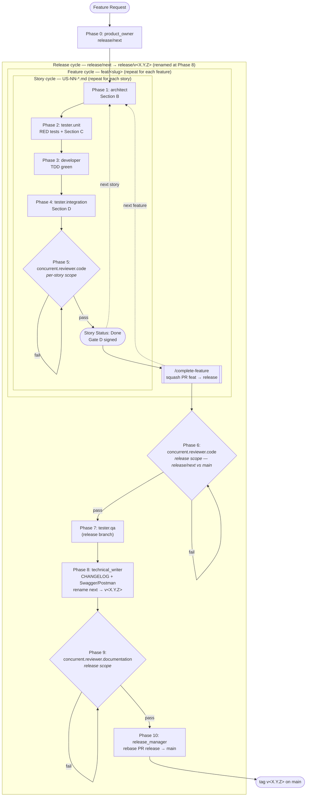

# Agentic SDLC Workflow

Release-centric, branch-aware workflow for implementing features in the Camus API. Each phase produces a
deliverable that feeds the next, with human approval gates between phases. Agents are invoked with `@name` in
Copilot Chat; user-invocable skills are invoked with `/skill-name`.

## Branch model

```text
main
 └── release/next         (work-in-progress release; created by @product_owner on first feature)
      │                     (renamed to release/v<X.Y.Z> by @technical_writer at release time)
      └── feat/<slug>      (one per feature; created by ensure-on-feature-branch)
```

- `release/next` is the working release branch while the version is still undecided; the technical
  writer renames the folder and branch to the concrete `v<X.Y.Z>` at release time (Phase 8 via
  `apply-release-version`).
- `feat/<slug>` is always merged into `release/next` via **squash + delete branch** (`/complete-feature`).
  Feature merges never target `release/v<X.Y.Z>` — `ensure-on-feature-branch` refuses to operate on a
  finalized release, so all feature work must land before the Phase 8 rename.
- `release/v<X.Y.Z>` is merged into `main` via **rebase + keep branch** (`@release_manager`), then tagged on
  `main`.

## Artifact layout

```text
docs/stories/<release-version>/        (`next` during development, renamed to `v<X.Y.Z>` at Phase 8)
 ├── _release.md                       (release metadata, features table, release-level gates)
 └── <feature-slug>/
      ├── _feature.md                  (feature metadata, stories table, feature-level gate)
      └── US-NN-<story-slug>.md        (per-story: Sections A–D + 4 handoff gates)
```

## Gate model

Per story (in `US-NN-*.md`):

| Gate | Section | Owner |
| ---- | ------- | ----- |
| A — Product Owner | Section A | `@product_owner` |
| B — Architect | Section B | `@architect` |
| C — Tester | Section C | `@tester.unit` / `@developer` |
| D — Integration Tester | Section D | `@tester.integration` |

Per release (in `_release.md`):

| Gate | Owner |
| ---- | ----- |
| QA | `@tester.qa` |
| Technical Writer | `@technical_writer` |
| Release Manager | `@release_manager` |

Per feature (in `_feature.md`): single feature-level gate signed by `/complete-feature` once every story is
Done and gates A–D are Yes/N/A.

## Workflow Overview

```text
┌──────────────────────────────────────────────────────────────────────────────┐
│                    RELEASE-CENTRIC AGENTIC SDLC PIPELINE                     │
├──────────────────────────────────────────────────────────────────────────────┤
│                                                                              │
│  ── Per release: PO scaffolds release + features (on release/next) ──────    │
│                                                                              │
│  Phase 0: PRODUCT OWNER ────── @product_owner                                │
│  │  Skill:  ensure-on-release-branch (creates release/next if missing)         │
│  │  Output: _release.md, <slug>/_feature.md, US-NN-*.md (Section A)          │
│  │  Commit + push on release branch                                          │
│  ▼                                                                           │
│  ── Per story: workers run on feat/<slug> ─────────────────────────────      │
│                                                                              │
│  Phase 1: ARCHITECT ────────── @architect                                    │
│  │  Skill: ensure-on-feature-branch                                          │
│  │  Output: Section B; commit + push                                         │
│  ▼                                                                           │
│  Phase 2: TESTER (UNIT) ────── @tester.unit                                  │
│  │  Output: stubs + RED tests + Section C; commit + push                     │
│  ▼                                                                           │
│  Phase 3: DEVELOPER ────────── @developer                                    │
│  │  Output: implementation (TDD green); commit + push                        │
│  ▼                                                                           │
│  Phase 4: INTEGRATION TESTER ─ @tester.integration                           │
│  │  Output: integration tests + Section D; commit + push                     │
│  ▼                                                                           │
│  Phase 5: CODE REVIEW ──────── @concurrent.reviewer.code                     │
│  │  Report → on FAIL ask to apply fixes → re-validate in new session         │
│  │  Re-invoke until PASS, then sign Gate D and mark Status: Done             │
│  ▼                                                                           │
│  ── Close feature: squash PR feat → release ──────────────────────────────   │
│                                                                              │
│  /complete-feature                                                           │
│  │  Verifies every story Done + gates A–D; signs feature gate                │
│  │  gh pr create --base release --head feat --title "feat: <slug>"           │
│  │  gh pr merge --squash --delete-branch                                     │
│  ▼                                                                           │
│  ── Per release: release-level validation (on release branch) ────────────   │
│                                                                              │
│  Phase 6: RELEASE CODE REVIEW @concurrent.reviewer.code                      │
│  │  Scope: release branch (release/next at this stage; diff vs main)         │
│  │  Report → on FAIL ask to apply fixes → re-validate in new session         │
│  ▼                                                                           │
│  Phase 7: QA ────────────────── @tester.qa                                   │
│  │  Skill: ensure-on-release-branch                                          │
│  │  Output: full suite + coverage + local validation; sign QA gate           │
│  ▼                                                                           │
│  Phase 8: TECHNICAL WRITER ─── @technical_writer                             │
│  │  CHANGELOG entry, Swagger/Postman/READMEs, rename next → v<X.Y.Z>         │
│  │  Sign Technical Writer gate                                               │
│  ▼                                                                           │
│  Phase 9: DOCUMENTATION REVIEW @concurrent.reviewer.documentation            │
│  │  Report → on FAIL ask to apply fixes → re-validate in new session         │
│  ▼                                                                           │
│  Phase 10: RELEASE MANAGER ─── @release_manager                              │
│  │  Sign RM gate; gh pr create --base main --head release                    │
│  │  gh pr merge --rebase --delete-branch=false                               │
│  │  Tag on main; push tag                                                    │
│  ▼                                                                           │
│  RELEASED ✓                                                                  │
│                                                                              │
└──────────────────────────────────────────────────────────────────────────────┘
```

The same flow rendered as a Mermaid diagram (GitHub renders this natively). Laid out top-to-bottom,
the diagram shows the nested cycles: the inner **per-story** cycle (Phases 1–5) repeats for every story
inside a feature — Phase 5 delivers a report and, on FAIL, optionally applies fixes; you re-validate by
re-invoking the reviewer in a new chat session until PASS. The outer **per-feature** cycle wraps the story
cycle and is closed by `/complete-feature`; the **per-release** phases (6–10) run once on the release branch
and produce the tag on `main`. Phases 6 and 9 follow the same report-then-optionally-fix-then-revalidate loop.



## Phases in Detail

### Phase 0: Product Owner — `@product_owner`

**Invoke:** `@product_owner` → describe the feature request in free text.

Example: `@product_owner I need CRUD operations for managing user profiles with email validation`

**What the agent does:**

1. Invokes the `ensure-on-release-branch` skill. With no version provided, the skill resolves to the
   placeholder `next` mapped to `release/next`, creates the branch off `main` if missing, and scaffolds
   `docs/stories/next/_release.md` from the template.
2. Derives `feature-slug` from the request, confirms it with you, and scaffolds
   `docs/stories/<release>/<feature-slug>/_feature.md` if it does not exist.
3. Decomposes the feature into atomic stories and scaffolds each
   `docs/stories/<release>/<feature-slug>/US-NN-<story-slug>.md` from the template.
4. Populates Section A on every story (story statement, scope, FRs, NFRs, ACs), batching clarifications up to
   five rounds.
5. Updates the feature's Stories table and the release's Features table; signs Gate A on every story and the
   Product Owner gate on the feature.
6. Commits and pushes all scaffolded artifacts to the release branch.

**Deliverable:** Release branch with `_release.md`, `_feature.md`, and Section A complete on every story.
**Your role:** Confirm the slug. Review stories for scope and acceptance criteria. Approve before architect.

---

### Phase 1: Architect — `@architect`

**Invoke:** `@architect` → provide the path to a story file with completed Section A.

Example: `@architect #file:docs/stories/next/user-profiles/US-01-create-profile.md`

**What the agent does:**

1. Validates Gate A.
2. Invokes `ensure-on-feature-branch` with the feature slug derived from the story path. The skill positions
   the working tree on `feat/<slug>` (creating it from the release branch if missing). If the release branch
   does not exist, the skill FAILs — Product Owner must scaffold first.
3. Populates Section B (Layer Impact Matrix, Cross-Cutting Concerns, Delivery and Rollout) following
   hexagonal boundaries.
4. Signs Gate B when every gate item is `Yes`.
5. Commits and pushes the story update to the feature branch.

**Your role:** Verify layer mapping and NFR coverage. Approve before tester.unit.

---

### Phase 2: Tester (Unit) — `@tester.unit`

**Invoke:** `@tester.unit` → story file with Sections A and B complete.

**What the agent does:**

1. Validates Gate B and invokes `ensure-on-feature-branch`.
2. Scaffolds production stubs from the Layer Impact Matrix; builds until stubs compile (up to 5 cycles).
3. Presents the production skeleton for your review (up to 5 review cycles).
4. Writes test classes mapping each AC to test methods (xUnit + FluentAssertions + Moq, AAA pattern).
5. Verifies tests fail for the right reason (TDD red), redesigning when a stub accidentally satisfies a test.
6. Populates Section C (Skeleton Inventory + Test Traceability), signs Gate C, commits and pushes.

**Your role:** Review skeleton and test design. Approve before developer.

---

### Phase 3: Developer — `@developer`

**Invoke:** `@developer` → story file with Section C tests in RED.

**What the agent does:**

1. Validates Gate C and invokes `ensure-on-feature-branch`.
2. Implements production code in dependency order (Domain → Application → Database Schema → API → Adapters).
3. Builds, fixing compilation errors up to 5 times.
4. Runs unit tests up to 5 iterations until all pass (TDD green).
5. Runs integration tests up to 5 iterations; fixes production code or updates affected integration tests to
   reflect new contracts, recording each adjustment in the Regression Fixes Log.
6. Updates Section C status, signs the Developer Handoff Gate, commits and pushes.

**Note:** Code review is handled in Phase 5, not by the developer.

**Your role:** Review implementation. Approve before integration tester.

---

### Phase 4: Integration Tester — `@tester.integration`

**Invoke:** `@tester.integration` → story file with Developer Handoff Gate complete.

**What the agent does:**

1. Validates the Developer Handoff Gate and invokes `ensure-on-feature-branch`.
2. Invokes the `derive-integration-plan` skill to identify cross-layer boundaries and classify existing
   coverage.
3. If gaps exist, presents the proposed test plan and waits for approval (up to 3 revision cycles).
4. Creates or modifies integration tests in `emc.camus.api.integration.test`; builds and runs them,
   distinguishing test defects (fixes them) from production defects (records as findings).
5. Populates Section D (Integration Test Traceability + Findings), commits and pushes.

**Your role:** Review findings. Decide whether to re-invoke `@developer` to fix production code or accept
findings. Approve before code review.

---

### Phase 5: Code Review — `@concurrent.reviewer.code`

**Invoke:** `@concurrent.reviewer.code uncommitted` (or scope path / `feat/<slug>` branch).

`@concurrent.reviewer.code` resolves the scope, dispatches three sub-agents (GPT, Opus, Sonnet) against the
matching instruction checklists, and produces a consolidated compliance report. On a FAIL verdict the agent
asks whether to apply the reported fixes in the current session; re-validation is always done in a new session
to avoid confirmation bias.

**Your role:** On FAIL, decide whether to let the agent apply the fixes (or fix manually). Then start a new
chat session and re-invoke `@concurrent.reviewer.code` with the same scope until the verdict is PASS. Then
mark the story `Status: Done` and sign Gate D.

---

### Closing the feature — `/complete-feature`

**Invoke:** `/complete-feature <feature-slug>` once every story in the feature folder has `Status: Done` and
gates A–D marked `Yes` or `N/A`.

The skill:

1. Invokes `ensure-on-feature-branch` to position you on `feat/<slug>`.
2. Verifies every `US-*.md` has `Status: Done` and gates A–D signed.
3. Marks `_feature.md` `Status: Done`, signs the feature gate, commits and pushes.
4. Runs `gh pr create --base release/next --head feat/<slug> --title "feat: <slug>"`. Feature PRs always
   target `release/next`; the Phase 8 rename to `release/v<X.Y.Z>` happens only after every feature has been
   closed.
5. Waits for your confirmation, then `gh pr merge --squash --delete-branch`.
6. Checks out `release/next` and pulls.

**Your role:** Confirm the PR merge.

---

### Phase 6: Release Code Review — `@concurrent.reviewer.code`

**Invoke:** `@concurrent.reviewer.code <release-branch>` once every in-scope feature has been closed via
`/complete-feature`. `<release-branch>` is always `release/next` at this point in the cycle — the rename to
`release/v<X.Y.Z>` does not occur until Phase 8. The scope resolves to the diff between the release branch
and `main`, covering every squashed commit across all features in the release.

The agent produces a consolidated compliance report against the entire release scope. On a FAIL verdict the
agent asks whether to apply the reported fixes in the current session; re-validation is always done in a new
session.

**Your role:** On FAIL, decide whether to let the agent apply the fixes (or fix manually). Then start a new
chat session and re-invoke `@concurrent.reviewer.code` with the release branch scope until the verdict is
PASS. Per-story Phase 5 reviews validate isolated implementations; this release-level review catches
cross-story regressions, conflicting decisions across features, and scope drift introduced by squash merges.

---

### Phase 7: QA — `@tester.qa`

**Invoke:** `@tester.qa` → path to `docs/stories/<release-version>/_release.md` (typically `next` at this
stage). Run only after every in-scope feature has been closed via `/complete-feature` and the Phase 6 release
code review verdict is PASS.

**What the agent does:**

1. Validates every in-scope story `Status: Done` and gates A–D signed, and that the release code review (Phase 6)
   reached PASS. On BLOCKED, recommends running `/complete-feature` for the affected features or re-running
   the release code review.
2. Invokes `ensure-on-release-branch`.
3. Runs the full test suite (`test-all`).
4. Collects coverage (`test-refresh-coverage-report`) and presents gaps below 100%; writes approved coverage
   tests, then re-runs `test-unit` until green (up to 3 iterations).
5. Runs integration tests.
6. Guides you through local validation (Docker Compose + Postman collection + teardown).
7. Signs the QA gate on `_release.md`; commits and pushes the release branch.

**Your role:** Approve coverage test writing for each gap. Execute local validation. Confirm.

---

### Phase 8: Technical Writer — `@technical_writer`

**Invoke:** `@technical_writer` → path to `_release.md` with the QA gate signed.

**What the agent does:**

1. Validates the QA gate. On BLOCKED, recommends running `/complete-feature` for any feature missing a closure.
2. Invokes `ensure-on-release-branch`.
3. Walks every story under the release and collects production deltas (modified files, new HTTP endpoints).
4. Invokes the `update-changelog` skill — determines version bump (MAJOR | MINOR | PATCH), updates
   `Directory.Build.props`, and writes the release entry to `CHANGELOG.md` grouped by Keep a Changelog
   subsections.
5. Updates Swagger/OpenAPI XML annotations, the Postman collection, and any affected adapter READMEs.
6. Runs the `markdown-lint` skill and fixes any errors.
7. Renames the folder and branch from `next`/`release/next` to the concrete
   `v<X.Y.Z>`/`release/v<X.Y.Z>` via `apply-release-version` (`git mv` + `git branch -m` + push old branch
   deleted). The skill fails if the folder or branch is already on a concrete version.
8. Signs the Technical Writer gate on `_release.md`; commits and pushes.

**Your role:** Review the version bump rationale and CHANGELOG entry. Approve before doc review.

---

### Phase 9: Documentation Review — `@concurrent.reviewer.documentation`

**Invoke:** `@concurrent.reviewer.documentation uncommitted` (or scope path / release branch).

Three sub-agents evaluate the released documentation against the documentation conventions checklist; the
report is consolidated. On a FAIL verdict the agent asks whether to apply the reported fixes in the current
session; re-validation is always done in a new session.

**Your role:** On FAIL, decide whether to let the agent apply the fixes (or fix manually). Then start a new
chat session and re-invoke `@concurrent.reviewer.documentation` with the same scope until PASS. Doc review runs
**after** TW so the reviewer validates the final shipped documentation (CHANGELOG, Swagger, Postman, READMEs).

---

### Phase 10: Release Manager — `@release_manager`

**Invoke:** `@release_manager` → path to `_release.md` with Technical Writer + QA gates signed and the
documentation review PASS.

**What the agent does:**

1. Validates release `Status: Ready for Deployment` and both prior gates.
2. Invokes `ensure-on-release-branch`.
3. Signs the Release Manager gate (CHANGELOG breaking-change entries confirmed). Commits and pushes.
4. Runs `gh pr create --base main --head release/v<X.Y.Z>`.
5. Waits for your confirmation, then `gh pr merge --rebase --delete-branch=false` (release branch is preserved
   for traceability).
6. Checks out `main`, pulls, `git tag -a v<X.Y.Z>`, pushes the tag, captures `tag_sha`, and produces the report.

**Your role:** Confirm the PR merge. The tag is created on `main` after rebase so it points at the deployed
commits.

---

## Quick Reference

| Phase | Agent / Skill | Branch | Input | Output |
| ----- | ------------- | ------ | ----- | ------ |
| 0 | `@product_owner` | release | feature request (free text) | `_release.md` + `_feature.md` + Section A |
| 1 | `@architect` | feat | story file (Section A) | Section B |
| 2 | `@tester.unit` | feat | story file (Sections A + B) | stubs + RED tests + Section C |
| 3 | `@developer` | feat | story file (Section C RED) | implementation (TDD green) |
| 4 | `@tester.integration` | feat | story file (Developer Gate) | integration tests + Section D |
| 5 | `@concurrent.reviewer.code` | feat | scope or branch (per-story) | code review PASS |
| close | `/complete-feature` | feat → release | `<feature-slug>` | squash PR merged; release pulled |
| 6 | `@concurrent.reviewer.code` | release | `<release-branch>` (vs main) | release code review PASS |
| 7 | `@tester.qa` | release | `_release.md` | QA gate signed |
| 8 | `@technical_writer` | release | `_release.md` (QA signed) | CHANGELOG + Swagger + Postman + lint; TW gate |
| 9 | `@concurrent.reviewer.documentation` | release | scope or branch | doc review PASS |
| 10 | `@release_manager` | release → main | `_release.md` (TW + QA signed) | rebase PR + tag on `main` |

## Tips

- **Start a new chat session** for each agent invocation to keep context clean.
- **Reference files** with `#file:path` in Copilot Chat for precise context.
- **Branch creation is split by responsibility:** the Product Owner owns release branch creation
  (`ensure-on-release-branch`); workers never create release branches and `ensure-on-feature-branch` FAILs if
  the release branch is missing.
- **Section C is the TDD tracker** — `@tester.unit` populates it (Skeleton Inventory + Test Traceability),
  `@developer` updates it.
- **Section D is the integration tracker** — `@tester.integration` populates it (Traceability + Findings).
- **Per-story merges via `/complete-feature`** — never merge `feat/<slug>` manually; the skill enforces
  Done/gates before opening the squash PR.
- **Per-release merges via `@release_manager`** — rebase preserves the release branch for traceability; the
  tag is created on `main` after the rebase lands.
- **Code review runs twice:** per-story (Phase 5) on the feature branch against the implementation, and
  per-release (Phase 6) on the release branch against the cumulative diff vs `main` — catching cross-story
  regressions before QA.
- **Documentation review runs per release (Phase 9)** — after Technical Writer, against the released docs.
- **`@concurrent.reviewer.code` / `@concurrent.reviewer.documentation`** deliver the report first; on FAIL
  they offer to apply the reported fixes in the current session. Re-validation always happens in a new chat
  session to keep the verdict free of confirmation bias.
- **`@concurrent.reviewer.copilot.customization`** maintains SDLC quality — run it when modifying agents,
  prompts, instructions, or skills (not during feature development).
- **The story file is the single source of truth** for stories; `_feature.md` for features; `_release.md` for
  releases.

## CI/CD Enforcement

The workflow narrative above is enforced by GitHub Actions. Each workflow guards a specific transition; if any
required check fails, the PR cannot merge or the deploy will not run.

| Workflow | Trigger | Enforces | Blocks |
| -------- | ------- | -------- | ------ |
| [`validate-pr-branches.yml`](../.github/workflows/validate-pr-branches.yml) | PR to `main`, `release/next`, or `release/v*` | Branching model: `feat/<slug>` → `release/next` → `release/v<X.Y.Z>` → `main` (PRs targeting `release/v*` are rejected) | PR merge on mismatched source/target |
| [`ci-unit-test.yml`](../.github/workflows/ci-unit-test.yml) | PR to `main` or `release/next`; `workflow_call` | Solution builds and full unit test suite passes | PR merge on build or unit test failure |
| [`ci-integration-test.yml`](../.github/workflows/ci-integration-test.yml) | PR to `main` or `release/next`; `workflow_call` | Integration test suite passes against ephemeral infrastructure | PR merge on integration test failure |
| [`build-and-deploy.yml`](../.github/workflows/build-and-deploy.yml) | Push of tag `v*` (created by `@release_manager`) | Runs unit + integration tests, builds the container, pushes to ACR, deploys via OIDC | Tag promotion on any pre-deploy check failure |
| [`build-version-check.yml`](../.github/workflows/build-version-check.yml) | PR to `main` | `Directory.Build.props` version matches the latest `CHANGELOG.md` entry and is bumped vs `main` | Release-to-main PR merge on version drift |
| [`codeql-analysis.yml`](../.github/workflows/codeql-analysis.yml) | Push to `main`; PR to `main` | C# static security analysis | PR merge on new CodeQL findings (when configured as required) |
| [`dependency-vulnerability-scan.yml`](../.github/workflows/dependency-vulnerability-scan.yml) | PR to `main` | NuGet dependency vulnerability scan | PR merge on critical vulnerabilities (when configured as required) |
| [`markdown-lint.yml`](../.github/workflows/markdown-lint.yml) | PR to `main` or `release/next` touching `*.md` | Markdown lint passes across the repository | PR merge on lint errors |
| [`docker-lint.yml`](../.github/workflows/docker-lint.yml) | PR to `main` or `release/next` touching `Dockerfile*` | Hadolint passes on Dockerfiles | PR merge on Dockerfile lint errors |

## GitHub UI Configuration

The automated pipeline relies on repository-level settings that must be configured once via the GitHub UI.
This section is a runbook — it names every required object but never lists secret values.

### Branch rulesets

Configure two rulesets under **Settings → Rules → Rulesets**:

- **`main`**
  - Target: branch `main`.
  - Require a pull request before merging.
  - Require status checks to pass: `build`, `test-unit`, `test-integration`.
  - Require linear history.
  - Block direct pushes and force pushes.
  - Restrict deletions.
  - Bypass list: empty (no human bypass; release manager merges via PR only).
- **`release/*`**
  - Target: branch pattern `release/*`.
  - Require a pull request before merging (squash from `feat/*`, `fix/*`, `chore/*`, `docs/*`).
  - Require status checks to pass on PRs: `build`, `test-unit`, `test-integration`.
  - Block direct pushes and force pushes.
  - Restrict deletions.
  - Bypass list: `Repository admin` role. Release-scope skills push directly to
    `release/*` and must be executed by a repository admin (or via a bot account
    granted the admin role). Affected operations:
    - [`apply-release-version`](../.github/skills/apply-release-version/SKILL.md)
      renames `release/next` → `release/vX.Y.Z`.
    - [`commit-and-push-on-release-branch`](../.github/skills/commit-and-push-on-release-branch/SKILL.md)
      commits `CHANGELOG.md`, `Directory.Build.props`, and `_release.md` updates.
    - [`technical_writer`](../.github/agents/technical_writer.agent.md) commits
      consolidated release documentation.

### Environments

Configure two environments under **Settings → Environments**:

- **`development`**
  - Deployment branches: `release/*` only.
  - Required reviewers: none (automated).
  - Secrets: `AZURE_CLIENT_ID_DEV`, `AZURE_TENANT_ID`, `AZURE_SUBSCRIPTION_ID_DEV` (OIDC; no client secret).
  - Variables: `ENV_NAME=development`, `RESOURCE_GROUP=<dev-rg>`.
- **`production`**
  - Deployment branches: `main` only.
  - Required reviewers: at least one repository admin.
  - Wait timer: 0–30 minutes (operator preference).
  - Secrets: `AZURE_CLIENT_ID_PROD`, `AZURE_TENANT_ID`, `AZURE_SUBSCRIPTION_ID_PROD`.
  - Variables: `ENV_NAME=production`, `RESOURCE_GROUP=<prod-rg>`.

### OIDC federated credentials

In Microsoft Entra ID, register a workload identity for each environment with **federated credential** subjects
(no client secrets stored in GitHub):

- Development credential subject: `repo:Camus-Labs/camus-template-api:environment:development`.
- Production credential subject:  `repo:Camus-Labs/camus-template-api:environment:production`.
- Audience: `api://AzureADTokenExchange`.
- Assign the service principal the minimum Azure roles required by the deployment workflow on the target
  resource group only.

### Repository settings

- **Settings → General → Pull Requests:** disable merge commits; enable squash merging and rebase merging
  (squash is used `feat → release`; rebase is used `release → main`).
- **Settings → Actions → General:** workflow permissions = read; allow `id-token: write` only at the workflow
  level for OIDC steps.
- **Settings → Code security:** enable secret scanning, push protection, and Dependabot security updates.

No secret value is ever committed to the repository; all credentials flow through GitHub environment secrets
and OIDC federated identity.
